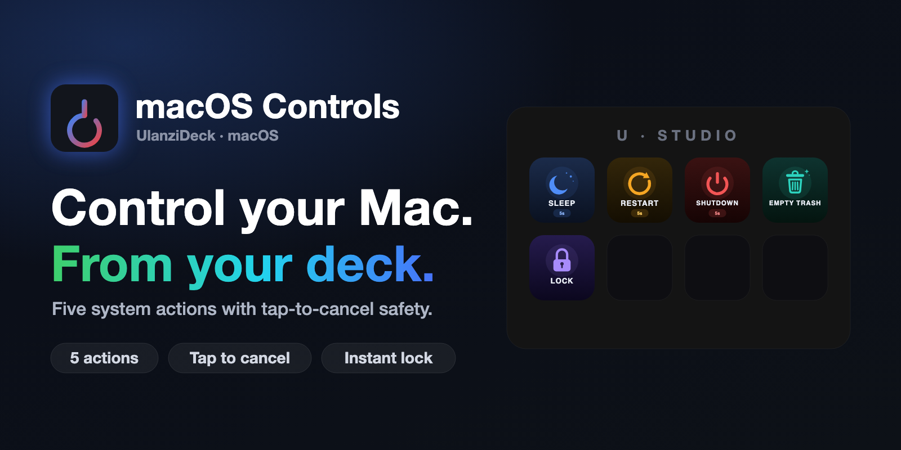
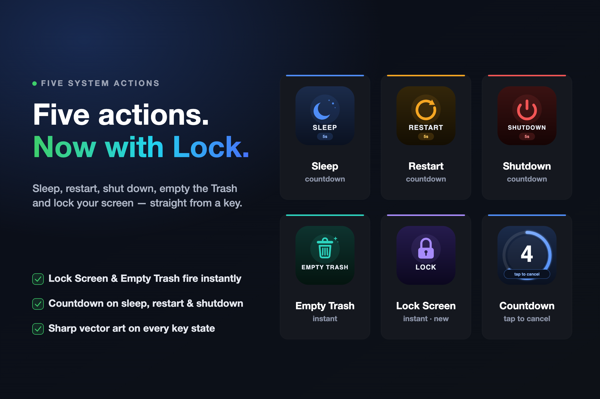
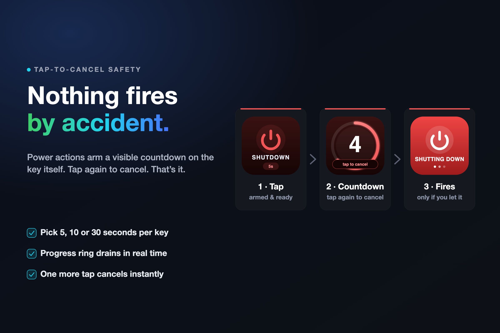

# macOS Controls - Ulanzi Deck Plugin

**Five Mac power actions, live on physical keys.**

Sleep, restart, shut down, empty the Trash and lock your screen — one tap, no menus, no mouse. Power actions arm a visible countdown with tap-to-cancel safety, so nothing fires by accident.



[](https://ulanzicommunitystore.narlei.com)
[](LICENSE)
[]()
[]()
[]()

---

## Why this exists

Reaching for a menu bar icon or a confirmation dialog to sleep or lock the Mac breaks flow — and a stray click on "Shut Down" is expensive if you weren't ready for it. macOS Controls puts five system actions on physical keys and arms the risky ones with a visible, cancellable countdown, so a key press is always a deliberate choice, not an accident.

---

## Install

```bash
git clone https://github.com/narlei/ulanzideck-macos-controlls
cd ulanzideck-macos-controlls
make install   # sync the plugin folder + restart Ulanzi Studio
```

> **Requirements:** macOS 10.15+ · [Ulanzi Studio](https://www.ulanzi.com/pages/download)

`make install` symlinks the plugin bundle into Ulanzi Studio's plugin folder and restarts the app. UlanziDeck ships its own Node runtime, so there's nothing else to install. On first use, Lock Screen and the power actions may prompt for the Accessibility permission — grant it once and every key keeps working.

---

## One key, five actions

Drag any action onto your deck. Sleep, Restart and Shutdown arm a countdown; Empty Trash and Lock Screen fire the moment you tap.



| Key | Idle | A tap does | Countdown |
|---|---|---|---|
| **Sleep** | moon icon | starts a 5/10/30s countdown | tap again to cancel |
| **Restart** | restart icon | starts a 5/10/30s countdown | tap again to cancel |
| **Shutdown** | power icon | starts a 5/10/30s countdown | tap again to cancel |
| **Empty Trash** | trash icon | empties the Trash instantly | none |
| **Lock Screen** | padlock icon | locks the screen instantly | none |

Each countdown key has its own duration, set per-button in the property inspector — no global setting to fight with.

---

## Nothing fires by accident

Sleep, Restart and Shutdown draw a live progress ring on the key itself as the countdown drains, with a "tap to cancel" pill and a big number counting down. A second tap at any point cancels — the action only runs if you let the ring reach zero.



Empty Trash and Lock Screen skip the countdown on purpose: they're reversible-in-spirit and low-risk, so they act the instant you tap.

---

## Speaks your language

The plugin, its five action names/tooltips, every property inspector, and the "tap to cancel" text on the key itself are all localized — 9 languages out of the box: English, Portuguese (BR), German, Spanish, French, Japanese, Korean, and Chinese (Simplified & Traditional/HK). The right language loads automatically from Ulanzi Studio's own language setting, with English as the fallback.

---

## Privacy & security

- **Nothing leaves your Mac.** Every action runs a local `pmset` or `osascript` command — there's no network call, no server, no telemetry, nothing to phone home to.
- **No credentials, no accounts.** There's nothing to sign in to.
- **Accessibility permission is scoped to what it's for.** It's what lets the plugin send the native lock shortcut and control System Events; if it's ever denied, Lock Screen falls back to turning off the display instead of failing silently.
- **Open source.** Every line is in this repo — audit it yourself.

---

## Development

```bash
git clone https://github.com/narlei/ulanzideck-macos-controlls
cd ulanzideck-macos-controlls
make install   # sync to UlanziDeck + restart Ulanzi Studio
```

| Command | What it does |
|---|---|
| `make package` | Build a distributable ZIP → `dist/` |
| `make install` | Sync plugin + restart Ulanzi Studio |
| `make restart` | Restart Ulanzi Studio only |
| `make clean` | Remove `dist/` |
| `make bump_patch` | Bump version (patch / minor / major) |
| `node tools/gen-banners.mjs` | Regenerate store art from the real key renders |

Set `MACCTRL_NO_CONNECT=1` when running `node app.js` by hand to load it without opening the WebSocket connection (useful for testing the SVG renderer in isolation).

**Layout**

```
com.narlei.macoscontrolls.ulanziPlugin/   # the plugin bundle
├── app.js                # main service: state machine + SVG key renderer
├── manifest.json
├── en.json / pt_BR.json / de.json / …    # localization (9 languages)
├── icons/                # per-action static SVG icons
├── pi/                   # property inspectors (one HTML per action)
└── sdk/                  # UlanziDeck Node SDK (WebSocket client)
tools/                    # store art generator (renders real keys → PNG banners)
resources/                # cover.png, banner1.png, banner2.png
```

---

MIT © [Narlei Moreira](https://github.com/narlei)
